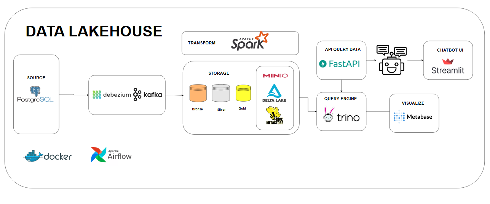
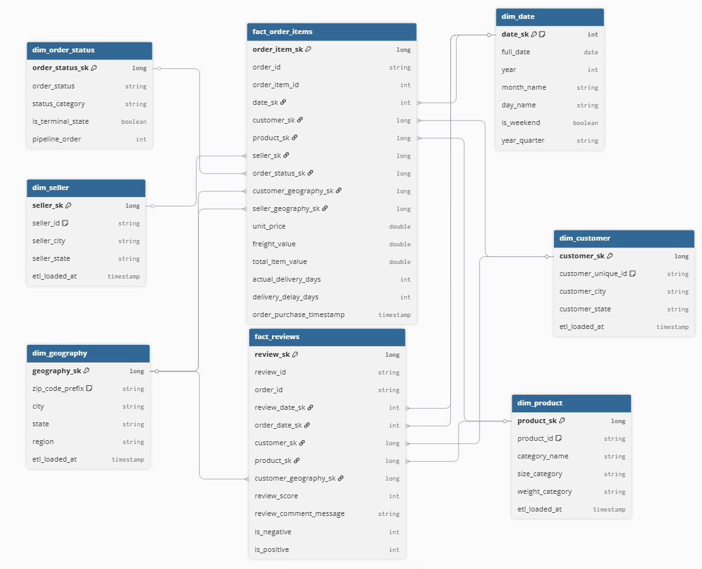

# DataLakeHouse - Olist E-commerce Analytics

## 📋 Tổng quan dự án

Hệ thống Data Lakehouse xử lý và phân tích dữ liệu thương mại điện tử Olist sử dụng kiến trúc Medallion (Bronze → Silver → Gold) với Apache Spark, Delta Lake, và MinIO.

### 🎯 Mục tiêu

- Xây dựng pipeline ETL tự động hóa với Change Data Capture (CDC)
- Áp dụng kiến trúc Medallion để quản lý chất lượng dữ liệu
- Thiết kế Star Schema cho phân tích dữ liệu
- Tích hợp các công cụ BI/Analytics hiện đại

### 🏗️ Kiến trúc hệ thống



### 🛠️ Stack công nghệ

| Thành phần | Công nghệ | Port |
|------------|-----------|------|
| Source DB | PostgreSQL | 5432 |
| CDC | Debezium Connect | 8083 |
| Messaging | Apache Kafka | 9092 |
| Storage | MinIO | 9000/9001 |
| Processing | Apache Spark | 7077/8080 |
| Query Engine | Trino | 8082 |
| Orchestration | Apache Airflow | 8081 |
| BI | Metabase | 3000 |
| Monitoring | Kafka UI | 8084 |
| API & Chatbot | FastAPI + Gemini AI | 8000 |

---

## 🚀 Hướng dẫn chạy từng bước

### Bước 1: Khởi động hệ thống

```bash
# Clone repository
git clone https://github.com/koi132/DataLakeHouse.git
cd DataLakeHouse

# Start all services
docker-compose up --build -d

# Verify services
docker ps
```

### Bước 2: Tạo databases

```bash
# Create Airflow database
docker exec -it postgres psql -U postgres -c "CREATE DATABASE airflow;"

# Create Metabase database
docker exec -it postgres psql -U postgres -c "CREATE DATABASE metabase;"
```

### Bước 3: Import dữ liệu vào PostgreSQL

```bash
# Copy dataset vào container
docker cp dataset/ecommerce/. postgres:/tmp/

# Copy SQL scripts
docker cp Script/. postgres:/tmp/

# Tạo tables
docker exec -it postgres psql -U postgres -d orders -f /tmp/create_tables.sql

# Import data
docker exec -it postgres psql -U postgres -d orders -f /tmp/import_raw.sql
```

### Bước 4: Đăng ký Debezium CDC Connector

**PowerShell:**

```powershell
curl.exe -X POST http://localhost:8083/connectors `
  -H "Content-Type: application/json" `
  -d "@e:\Projects\DataLakeHouse\connectors\postgres-olist-initial.json"
```

**Bash/CMD:**

```bash
curl -X POST http://localhost:8083/connectors -H "Content-Type: application/json" -d "@connectors/postgres-olist-initial.json"
```

### Bước 5: Chạy Kafka → Bronze ETL

```bash
# Vào Spark container
docker exec -it spark-master bash

# Submit batch job
/opt/spark/bin/spark-submit \
  --master spark://spark-master:7077 \
  --packages io.delta:delta-spark_2.12:3.2.0,org.apache.spark:spark-sql-kafka-0-10_2.12:3.5.0,org.apache.hadoop:hadoop-aws:3.3.4 \
  /opt/spark/app/process_kafka_to_bronze.py
```

### Bước 6: Chạy Bronze → Silver ETL

```bash
/opt/spark/bin/spark-submit \
  --master spark://spark-master:7077 \
  --packages io.delta:delta-spark_2.12:3.2.0,org.apache.hadoop:hadoop-aws:3.3.4 \
  /opt/spark/app/process_bronze_to_silver.py
```

### Bước 7: Chạy Silver → Gold ETL

```bash
/opt/spark/bin/spark-submit \
  --master spark://spark-master:7077 \
  --packages io.delta:delta-spark_2.12:3.2.0,org.apache.hadoop:hadoop-aws:3.3.4 \
  /opt/spark/app/process_silver_to_gold.py
```

---
### Galaxy Schema



---

## 🔍 Truy cập Services

| Service | URL | Credentials |
|---------|-----|-------------|
| **FastAPI Chat** | http://localhost:8000 | - |
| Airflow | http://localhost:8081 | airflow / airflow |
| MinIO Console | http://localhost:9001 | admin / password123 |
| Spark Master UI | http://localhost:8080 | - |
| Kafka UI | http://localhost:8084 | - |
| Trino UI | http://localhost:8082 | - |
| Metabase | http://localhost:3000 | - |

---

## 📊 Dữ liệu

### Bronze Layer

- Raw CDC data từ Kafka
- Format: Delta Lake
- Location: `s3a://bronze/`

### Silver Layer

- Cleaned & transformed data
- Deduplication, type casting, business rules
- Location: `s3a://silver/`

### Gold Layer

- Star Schema (Dimensions + Facts)
- Optimized for analytics
- Location: `s3a://gold/`

**Dimension Tables:** dim_geography, dim_date, dim_customer, dim_seller, dim_product, dim_order_status

**Fact Tables:** fact_order_items, fact_reviews

---

## 🤖 API & AI Chatbot

### Tổng quan

Hệ thống cung cấp REST API và AI Chatbot để truy vấn dữ liệu từ Data Lakehouse thông qua Trino.


### Truy cập

| Service | URL | Mô tả |
|---------|-----|-------|
| Chat UI | http://localhost:8000 | Giao diện chat với AI |
| API Docs | http://localhost:8000/docs | Swagger documentation |
| API List | http://localhost:8000/apis | Danh sách API có sẵn |

### API Endpoints

#### Data APIs

```bash
# Lấy số lượng khách hàng
GET http://localhost:8000/api/v1/cus_cnt

# Lấy số lượng sản phẩm  
GET http://localhost:8000/api/v1/prd_cnt

# Lấy schema của API
GET http://localhost:8000/api/v1/{api_name}/schema
```

#### Chatbot APIs

```bash
# Chat với AI
POST http://localhost:8000/chat
Content-Type: application/json
{
    "message": "Có bao nhiêu khách hàng?"
}

# Reset chat history
POST http://localhost:8000/chat/reset

# Xem lịch sử chat
GET http://localhost:8000/chat/history
```

### Cấu hình Gemini API Key

1. Lấy API key từ: https://aistudio.google.com/app/apikey

2. Mở file `api/core/chatbot.py` và thay thế API key:

```python
GEMINI_API_KEY = "your_api_key_here"  # Thay bằng key của bạn
```

### Thêm API mới

1. Tạo file SQL trong `api/sql/`:
```sql
-- api/sql/my_query.sql
SELECT * FROM delta.gold.dim_customer LIMIT 100
```

2. API tự động available tại:
```
GET http://localhost:8000/api/v1/my_query
```


